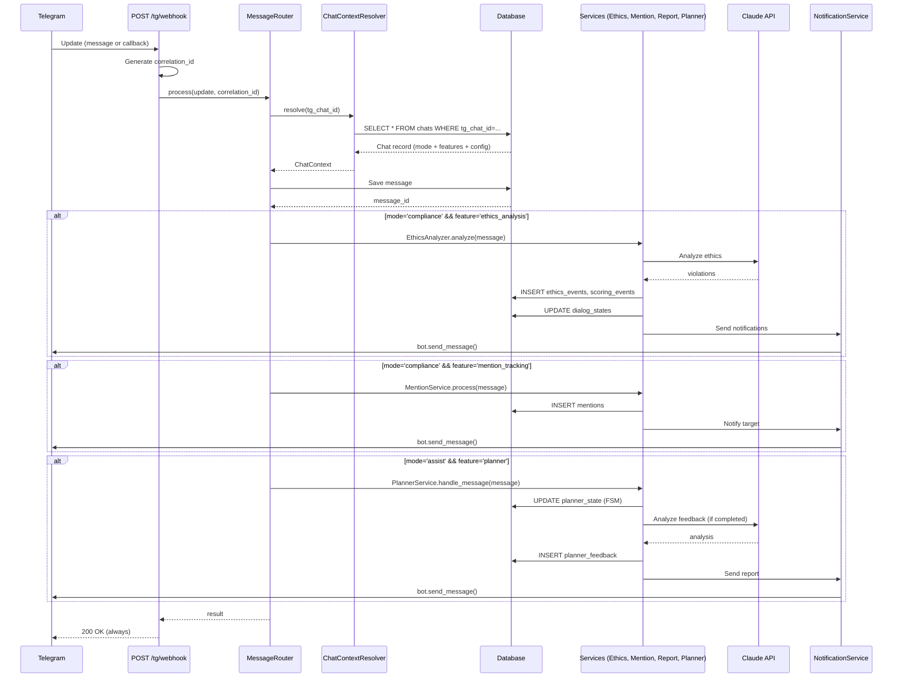
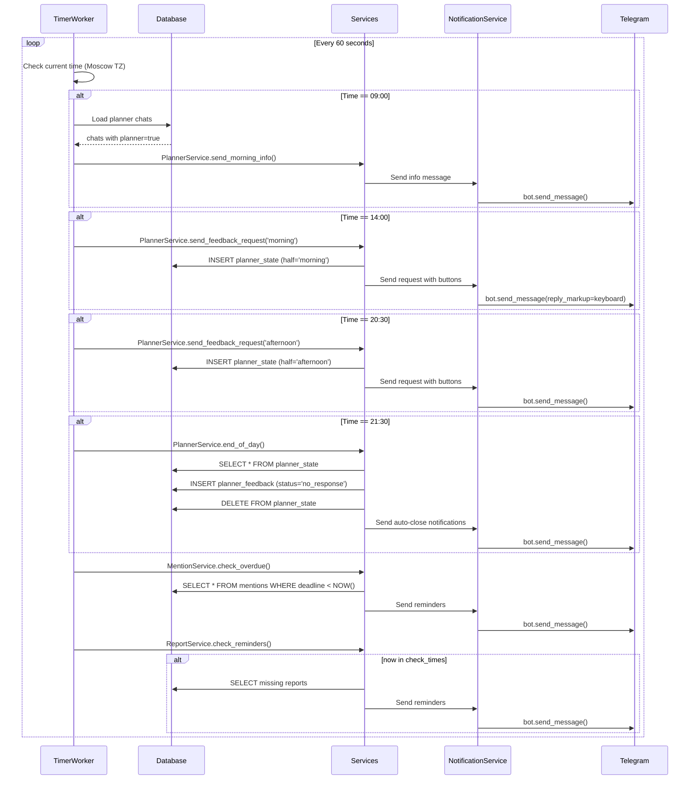
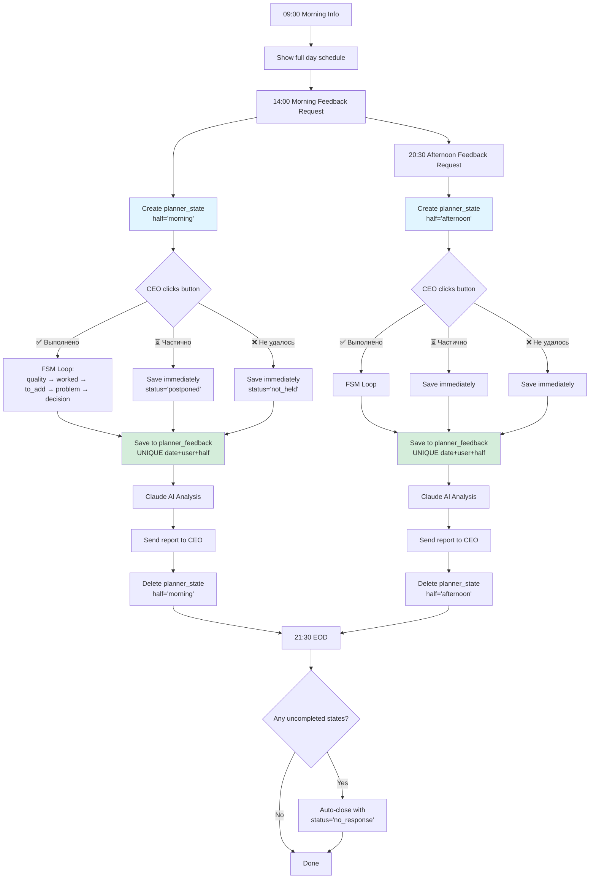
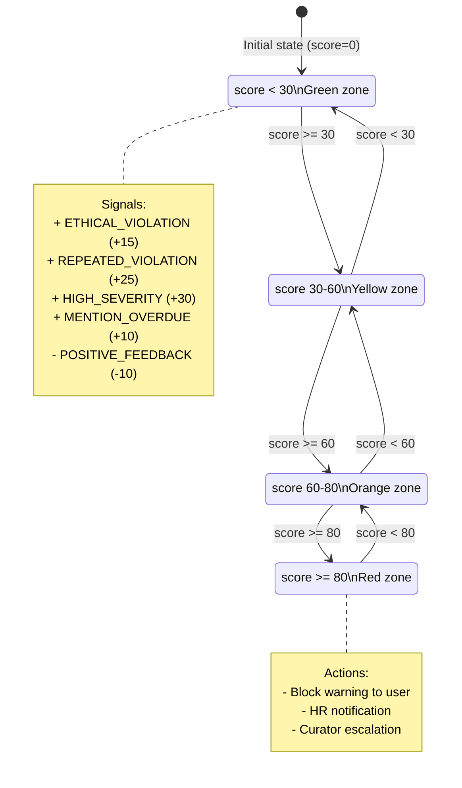

# Бизнес-логика Corporate Ethics Bot

## Обзор

Corporate Ethics Bot — это многофункциональная система автоматизации корпоративных процессов через Telegram. Основные функции:

1. **Мониторинг этики** — Автоматический анализ сообщений на нарушения корпоративной этики
2. **CEO Daily Planner** — Двухцикловая система обратной связи по планёркам
3. **Mention Tracking** — Отслеживание @упоминаний с дедлайнами
4. **Report Reminders** — Напоминания о ежедневных отчётах (РОП, ПЛК)
5. **Weekly Planning** — Недельное планирование менеджеров

---

## 1. Сценарии использования

### 1.1 Мониторинг этики в compliance-чате

**Участники**:
- Сотрудник (отправляет сообщение)
- Bot (анализирует)
- Арбитр (получает уведомление при нарушениях)

**Предусловия**:
- Чат зарегистрирован с `mode='compliance'`
- Feature `ethics_analysis` включён в `chats.features`

**Основной поток**:

```
1. Сотрудник отправляет сообщение в групповой чат
   └─> "Коллега, вы не правы. Это ваша вина."

2. Telegram → POST /tg/webhook
   └─> MessageRouter получает Update

3. MessageRouter → ChatContextResolver
   └─> Загрузка конфига из БД (chats table)
   └─> ctx.mode = 'compliance', ctx.features = {'ethics_analysis': true}

4. MessageRouter → Save message to DB
   └─> INSERT INTO messages (tg_chat_id, tg_user_id, text, correlation_id)

5. MessageRouter → EthicsAnalyzer.analyze(message)
   └─> Проверка: ctx.has_feature('ethics_analysis') → True

6. EthicsAnalyzer → RulesLoader
   └─> Загрузка правил из app/rules/*.yaml

7. EthicsAnalyzer → AIClient (Claude API)
   System Prompt: "Ты эксперт по корпоративной этике. Проанализируй сообщение..."
   User Prompt: "Коллега, вы не правы. Это ваша вина."
   └─> Response: {
         "violations": [{
           "category": "respect",
           "type": "blame_assignment",
           "severity": 0.6,
           "explanation": "Обвинение коллеги..."
         }]
       }

8. EthicsAnalyzer → Calculate risk_level
   └─> severity=0.6 → risk_level='MEDIUM'

9. EthicsAnalyzer → Save to DB
   └─> INSERT INTO ethics_events (
         tg_chat_id, tg_user_id, rule_category, violation_type,
         severity, risk_level, ai_analysis, correlation_id
       )

10. EthicsAnalyzer → ScoringEngine.process_signals()
    └─> INSERT INTO scoring_events (signal_type='ETHICAL_VIOLATION', weight=15)
    └─> UPDATE dialog_states SET score = score + 15
    └─> Check state transition: NORMAL (20) → TENSION (35)
    └─> INSERT INTO state_transitions (from_state='NORMAL', to_state='TENSION')

11. ScoringEngine → ArbitrationService.select_arbiter()
    └─> Matrix: user.role='MANAGER' + risk_level='MEDIUM' → arbiter=CURATOR
    └─> Query: SELECT curator_id FROM users WHERE tg_user_id = {author}
    └─> arbiter_user_id = 12345678

12. ArbitrationService → NotificationService
    └─> Send 3 notifications:
        a) SELF_FEEDBACK → author_user_id
           "⚠️ Обнаружено нарушение этики: обвинение коллеги. Рекомендуем..."
        b) ARBITER_ALERT → arbiter_user_id
           "⚠️ Сотрудник {name} допустил нарушение этики (MEDIUM)..."
        c) (Если state=ESCALATION) BLOCK_WARNING → author
           "⚠️ Критический уровень нарушений. Возможна блокировка..."

13. NotificationService → Telegram Bot API
    └─> bot.send_message(chat_id, text, parse_mode='HTML')
    └─> INSERT INTO notifications (type, tg_chat_id, tg_user_id, success)

14. MessageRouter → Response 200 OK
    └─> Telegram получает подтверждение
```

**Альтернативные потоки**:

**A1. Нарушение не обнаружено**:
- Шаг 7: Claude API возвращает `violations: []`
- Пропускаются шаги 8-12
- Только логирование в audit_log

**A2. Ошибка Claude API**:
- Шаг 7: Timeout или 500 error
- Логирование ошибки: `logger.error("AI analysis failed", correlation_id=...)`
- Retry с exponential backoff (tenacity)
- Если retry failed → пропуск анализа, return 200 OK (не блокируем Telegram)

**A3. High Risk + Role DIRECTOR**:
- Шаг 11: arbiter = HR_COMPLIANCE
- Дополнительное уведомление в HR чат

**Постусловия**:
- Сообщение сохранено в `messages`
- Нарушение записано в `ethics_events` (если обнаружено)
- Scoring event в `scoring_events`
- Dialog state обновлён в `dialog_states`
- Уведомления отправлены
- Логи в `audit_log`, `notifications`

---

### 1.2 CEO Daily Planner (v1.3 Two-Cycle)

**Участники**:
- CEO (получает запросы, отвечает)
- Bot (отправляет запросы, анализирует)
- TimerWorker (scheduled jobs)

**Предусловия**:
- Чат зарегистрирован с `mode='assist'`
- Feature `planner` включён
- В `config`: `planner_ceo_user_id`, `planner_timezone='Europe/Moscow'`

**Дневной цикл (4 точки)**:

#### 09:00 — Morning Info Message

```
1. TimerWorker.run() → Check time == 09:00 (Moscow)
   └─> await _check_planner_jobs(now)

2. TimerWorker → Load planner chats from DB
   └─> SELECT * FROM chats WHERE features->'planner' = true AND is_active = true

3. For each chat:
   └─> ctx = ChatContextResolver.resolve(tg_chat_id)
   └─> planner = PlannerService(ctx, db, correlation_id)

4. PlannerService.send_morning_info()
   └─> themes = PlannerDayThemes.get_schedule(today)
   └─> themes.all_blocks → [
         {"time": "10:00-11:00", "theme": "Проект А", "half": "morning"},
         {"time": "11:00-12:00", "theme": "Проект Б", "half": "morning"},
         {"time": "15:00-16:00", "theme": "Проект В", "half": "afternoon"},
         {"time": "16:00-17:00", "theme": "Проект Г", "half": "afternoon"}
       ]

5. PlannerFormatter.format_morning_info(themes)
   └─> HTML message с полным расписанием дня (БЕЗ кнопок)
   └─> "<b>📋 План дня на {date}</b>\n\n<b>Утренние блоки (10:00–14:00)</b>\n..."

6. NotificationService.send(ceo_user_id, message)
   └─> bot.send_message(ceo_user_id, text, parse_mode='HTML')
   └─> INSERT INTO notifications (type='PLANNER_MORNING_INFO')
```

#### 14:00 — Morning Feedback Request

```
7. TimerWorker → Check time == 14:00

8. PlannerService.send_feedback_request(half='morning')
   └─> themes = PlannerDayThemes.get_blocks_for_half('morning')
   └─> blocks = [
         {"time": "10:00-11:00", "theme": "Проект А"},
         {"time": "11:00-12:00", "theme": "Проект Б"},
         {"time": "12:00-13:00", "theme": "Проект В"},
         {"time": "13:00-14:00", "theme": "Проект Г"}
       ]

9. PlannerFormatter.format_feedback_request(themes, half='morning')
   └─> HTML message + inline keyboard:
       "📊 Как прошли утренние планёрки?\n\n10:00-11:00 Проект А\n..."
   └─> Buttons:
       [✅ Выполнено] [⏳ Частично] [❌ Не удалось]

10. NotificationService.send(ceo_user_id, message, reply_markup=keyboard)

11. PlannerService → CREATE planner_state
    └─> INSERT INTO planner_state (
          user_id, half='morning', current_step='awaiting_status',
          date=today, expires_at=today + 23:59:59
        )
    └─> UNIQUE(user_id, half) обеспечивает один FSM для morning

12. CEO нажимает кнопку "✅ Выполнено"
    └─> Telegram sends callback_query

13. Webhook → MessageRouter.process_callback_query()
    └─> callback_data = "planner_completed"

14. MessageRouter → PlannerService.handle_callback(callback_query)

15. PlannerService → Determine active half
    └─> Check both states:
        - state_morning = await _load_state(user_id, half='morning')
        - state_afternoon = await _load_state(user_id, half='afternoon')
    └─> state_morning.current_step == 'awaiting_status' → Process morning

16. PlannerService → FSM Step 1: AWAITING_STATUS → AWAITING_QUALITY
    └─> UPDATE planner_state SET
          meeting_status='held',
          current_step='awaiting_quality'
        WHERE user_id={ceo} AND half='morning'

17. PlannerService → Ask quality
    └─> bot.edit_message_text(message_id, "Оцените качество утренних планёрок (1-10)")
    └─> bot.answer_callback_query(callback_query_id, "Принято")

18. CEO отвечает: "8"
    └─> Webhook → MessageRouter → PlannerService.handle_message()

19. PlannerService → FSM Step 2: AWAITING_QUALITY → AWAITING_WORKED
    └─> Validate: 1 <= int(text) <= 10
    └─> UPDATE planner_state SET
          quality_score=8,
          current_step='awaiting_worked'

20. PlannerService → Ask "Что сработало хорошо?"
    └─> bot.send_message(ceo, "Что сработало хорошо в утренних планёрках?")

21. CEO: "Быстрое обсуждение проекта А"
    └─> FSM Step 3: AWAITING_WORKED → AWAITING_TO_ADD
    └─> UPDATE planner_state SET
          what_worked='Быстрое обсуждение...',
          current_step='awaiting_to_add'

22. PlannerService → Ask "Что добавить?"
    └─> bot.send_message(ceo, "Что можно добавить или улучшить?")

23. CEO: "Больше времени на проект Б"
    └─> FSM Step 4: AWAITING_TO_ADD → AWAITING_PROBLEM
    └─> UPDATE planner_state SET
          what_to_add='Больше времени...',
          current_step='awaiting_problem'

24. PlannerService → Ask "Главная проблема?" (optional)
    └─> bot.send_message(ceo, "Была ли главная проблема? (или 'нет')")

25. CEO: "нет"
    └─> Skip problem
    └─> FSM Step 5: AWAITING_PROBLEM → AWAITING_DECISION

26. PlannerService → Ask "Решение?" (optional)
    └─> bot.send_message(ceo, "Какое решение принято? (или 'нет')")

27. CEO: "Решили добавить час на проект Б завтра"
    └─> FSM Final Step: AWAITING_DECISION → SAVE

28. PlannerService → Save to planner_feedback
    └─> INSERT INTO planner_feedback (
          date=today, user_id={ceo}, half='morning',
          meeting_status='held', quality_score=8,
          what_worked='...', what_to_add='...',
          main_problem=NULL, decision_taken='Решили добавить час...'
        )
    └─> UNIQUE(date, user_id, half) обеспечивает один feedback

29. PlannerService → AI Analysis
    └─> AIClient.analyze(
          system_prompt=PLANNER_ANALYSIS_PROMPT,
          user_prompt=f"Feedback: {feedback.dict()}"
        )
    └─> Response: "Анализ: CEO оценил качество на 8/10. Положительно отмечено..."

30. PlannerService → Save analysis log
    └─> INSERT INTO planner_analysis_log (
          feedback_id, prompt_used, ai_response, model_name
        )

31. PlannerService → Send report to CEO
    └─> PlannerFormatter.format_analysis_report(feedback, analysis)
    └─> bot.send_message(ceo, report, parse_mode='HTML')
    └─> INSERT INTO notifications (type='PLANNER_ANALYSIS_REPORT')

32. PlannerService → Cleanup state
    └─> DELETE FROM planner_state WHERE user_id={ceo} AND half='morning'
```

#### 20:30 — Afternoon Feedback Request

```
33. TimerWorker → Check time == 20:30

34. PlannerService.send_feedback_request(half='afternoon')
    └─> Аналогично шагам 8-32, но:
        - half='afternoon'
        - blocks = [
            {"time": "15:00-16:00", "theme": "Проект Д"},
            {"time": "16:00-17:00", "theme": "Проект Е"},
            {"time": "17:00-18:00", "theme": "Проект Ж"},
            {"time": "18:00-19:00", "theme": "Проект З"}
          ]
        - Параллельный FSM (UNIQUE user_id+half позволяет)

35. Если morning цикл ещё не завершён:
    └─> Оба FSM работают параллельно
    └─> planner_state содержит ДВЕ записи:
        - (user_id={ceo}, half='morning')
        - (user_id={ceo}, half='afternoon')
```

#### 21:30 — End of Day (Auto-Close)

```
36. TimerWorker → Check time == 21:30

37. PlannerService.end_of_day()
    └─> Query: SELECT * FROM planner_state WHERE user_id={ceo}

38. For each uncompleted state (current_step != NULL):
    └─> If state.half == 'morning':
        └─> Check if feedback exists:
            SELECT * FROM planner_feedback WHERE date=today AND user_id={ceo} AND half='morning'
        └─> If NOT EXISTS:
            └─> INSERT INTO planner_feedback (
                  date=today, user_id={ceo}, half='morning',
                  meeting_status='no_response'
                )
            └─> bot.send_message(ceo, "Утренний цикл закрыт автоматически (no_response)")

    └─> If state.half == 'afternoon':
        └─> Same logic for afternoon

39. PlannerService → Cleanup all states
    └─> DELETE FROM planner_state WHERE user_id={ceo}
```

**Альтернативные потоки**:

**A1. CEO нажал "⏳ Частично"**:
- Шаг 16: meeting_status='postponed'
- Пропуск FSM (шаги 18-32)
- Immediate save to planner_feedback без quality score
- Отправка короткого подтверждения: "Принято. Планёрки перенесены."

**A2. CEO нажал "❌ Не удалось"**:
- meeting_status='not_held'
- Immediate save, пропуск FSM

**A3. CEO не ответил вообще**:
- 21:30: Auto-close с meeting_status='no_response'

**A4. Ошибка AI Analysis (шаг 29)**:
- Retry с tenacity
- Если failed → save feedback БЕЗ analysis, отправка feedback без AI insights

**Постусловия**:
- Два feedback записаны в `planner_feedback` (morning + afternoon)
- Два analysis log в `planner_analysis_log`
- Состояния удалены из `planner_state`
- Уведомления отправлены (4+ messages)
- Логи в `notifications`, `audit_log`

---

### 1.3 Mention Tracking

**Участники**:
- Автор (упоминает коллегу)
- Адресат (должен ответить)
- Bot (трекинг, напоминания)

**Предусловия**:
- Чат с `mode='compliance'`
- Feature `mention_tracking` включён
- В `config`: `mention_deadline_minutes=15`

**Основной поток**:

```
1. Автор отправляет: "@ivan_petrov, нужен отчёт до 15:00"

2. Webhook → MessageRouter → MentionService.process_message()

3. MentionService → Parse mentions
   └─> Detect: @username in text OR reply_to_message
   └─> target_username = 'ivan_petrov'

4. MentionService → Resolve user
   └─> SELECT * FROM users WHERE username='ivan_petrov'
   └─> target_user_id = 56789

5. MentionService → Calculate deadline
   └─> deadline = now + ctx.get_config('mention_deadline_minutes', 15)
   └─> deadline = "2026-02-11 15:15:00"

6. MentionService → Save mention
   └─> INSERT INTO mentions (
         tg_chat_id, target_user_id, author_user_id,
         tg_message_id, text, deadline, status='waiting', correlation_id
       )

7. MentionService → Send notification to target
   └─> bot.send_message(
         target_user_id,
         f"⏰ @{author} упомянул вас. Ответьте до {deadline:%H:%M}."
       )

8. TimerWorker.run() → Check mentions every 60 sec
   └─> await _check_mention_deadlines(now)

9. TimerWorker → Query overdue mentions
   └─> SELECT * FROM mentions WHERE status='waiting' AND deadline < NOW()

10. For each overdue mention:
    └─> MentionService.send_reminder(mention)
    └─> bot.send_message(
          target_user_id,
          f"⚠️ Напоминание: @{author} ждёт ответа. Дедлайн истёк."
        )
    └─> UPDATE mentions SET status='overdue'

11. If target отвечает (reply or mentions author):
    └─> MentionService.mark_answered(mention)
    └─> UPDATE mentions SET status='answered', answered_at=NOW()
    └─> bot.send_message(author, f"✅ @{target} ответил на ваше упоминание")
```

**Альтернативные потоки**:

**A1. Username не найден**:
- Шаг 4: user NOT EXISTS → пропуск, только логирование

**A2. Deadline превышен, но ответ получен**:
- Шаг 11: status='answered' даже если overdue

**A3. Reply вместо @mention**:
- Шаг 3: reply_to_message.from_user.id → target_user_id

---

### 1.4 Report Reminders

**Участники**:
- Менеджер (должен отправить отчёт)
- Bot (детектирование, напоминания)

**Предусловия**:
- Чат с `mode='compliance'`
- Feature `report_reminders` включён
- В `config`: `report_check_times=[{"hour": 10, "minute": 45}, {"hour": 14, "minute": 15}, {"hour": 19, "minute": 15}]`

**Основной поток**:

```
1. Менеджер отправляет: "РОП за 10.02.2026\n\nПроект А - 50%\nПроект Б - 30%"

2. Webhook → MessageRouter → ReportService.process_message()

3. ReportService → Detect report marker
   └─> Check first line: text.split('\n')[0]
   └─> Markers: ["РОП", "рапорт о проделанной", "ПЛК", "план контактов"]
   └─> Match: "РОП"

4. ReportService → Query report_types
   └─> SELECT * FROM report_types WHERE keywords @> '"РОП"'
   └─> report_type = {id: 1, name: "РОП"}

5. ReportService → Check if user is responsible
   └─> SELECT * FROM report_responsible
       WHERE user_id={author} AND report_type_id=1 AND is_active=true
   └─> responsible = True

6. ReportService → Save report
   └─> INSERT INTO daily_reports (
         tg_chat_id, tg_user_id, report_type_id,
         report_date=today, tg_message_id
       )

7. ReportService → Send confirmation
   └─> bot.send_message(author, "✅ Отчёт РОП зарегистрирован")

8. TimerWorker.run() → Check report reminders
   └─> check_times = ctx.get_config('report_check_times')
   └─> If now.hour==10 and now.minute==45:

9. TimerWorker → Query missing reports
   └─> SELECT rr.user_id, rt.name
       FROM report_responsible rr
       JOIN report_types rt ON rr.report_type_id = rt.id
       WHERE NOT EXISTS (
         SELECT 1 FROM daily_reports dr
         WHERE dr.tg_user_id = rr.user_id
           AND dr.report_type_id = rr.report_type_id
           AND dr.report_date = TODAY()
       )

10. For each missing report:
    └─> ReportService.send_reminder(user_id, report_type)
    └─> bot.send_message(
          user_id,
          f"⏰ Напоминание: отчёт {report_type.name} ещё не отправлен"
        )
```

**Альтернативные потоки**:

**A1. Marker не распознан**:
- Шаг 3: no match → пропуск

**A2. Пользователь не responsible**:
- Шаг 5: responsible=False → только логирование, no save

**A3. Повторная отправка отчёта**:
- Шаг 6: UNIQUE(tg_user_id, report_type_id, report_date) violation
- Обновление message_id вместо INSERT

---

### 1.5 Weekly Planning (Менеджеры)

**Участники**:
- Менеджер (отправляет план)
- Bot (парсинг, matching, сохранение)

**Предусловия**:
- Чат с `mode='planning'`

**Основной поток**:

```
1. Менеджер отправляет:
   "#Планирование неделя 03.02-09.02
   Проект Альфа - 40%
   Проект Бета - 30%
   Административные задачи - 30%"

2. Webhook → MessageRouter → PlanningService.process_message()

3. PlanningService → Detect planning marker
   └─> Check: text.startswith('#Планирование')
   └─> Match: True

4. PlanningService → Extract week dates
   └─> Regex: r'(\d{2}\.\d{2})-(\d{2}\.\d{2})'
   └─> week_start = "2026-02-03"
   └─> week_end = "2026-02-09"

5. PlanningService → Parse entries with Claude AI
   └─> AIClient.analyze(
         system="Extract projects and percentages from text",
         user=text
       )
   └─> Response: [
         {"project": "Проект Альфа", "percentage": 40},
         {"project": "Проект Бета", "percentage": 30},
         {"project": "Административные задачи", "percentage": 30}
       ]

6. PlanningService → Validate percentages
   └─> SUM(percentages) == 100%
   └─> If NOT: bot.send_message(author, "⚠️ Сумма должна быть 100%")
   └─> ABORT

7. PlanningService → Check/Create manager
   └─> SELECT * FROM planning_managers WHERE user_id={author}
   └─> If NOT EXISTS:
       └─> INSERT INTO planning_managers (user_id, manager_name, is_active)

8. PlanningService → Create submission
   └─> INSERT INTO planning_submissions (
         manager_id, tg_chat_id, week_start, week_end
       )
   └─> submission_id = LAST_INSERT_ID()

9. For each entry in parsed list:
    a) PlanningService → Match project with external DB
       └─> Query: SELECT * FROM 2_kadry_4.ref_projects_wa
           WHERE LOWER(name) LIKE '%альфа%'
       └─> If multiple matches:
           └─> AIClient.analyze("Choose best match: ...")
       └─> matched_project_id = 123

    b) PlanningService → Save entry
       └─> INSERT INTO planning_entries (
             submission_id, project_code=NULL, project_name='Проект Альфа',
             percentage=40, matched_project_id=123
           )

10. PlanningService → Send confirmation
    └─> bot.send_message(
          author,
          "✅ План на неделю 03.02-09.02 принят:\n• Проект Альфа - 40%\n..."
        )
```

**Альтернативные потоки**:

**A1. Маркер #Планирование не найден**:
- Шаг 3: no match → пропуск

**A2. Parsing failed (AI не вернул структурированный ответ)**:
- Шаг 5: JSON parse error
- bot.send_message(author, "⚠️ Не удалось распознать формат. Используйте: Проект - %")

**A3. Project matching failed**:
- Шаг 9a: no match in external DB
- Save with matched_project_id=NULL
- Ручная проверка позже

**A4. Повторная отправка плана за ту же неделю**:
- Шаг 8: DELETE старые entries + submission
- Создание новой submission (replace)

---

## 2. Потоки данных

### 2.1 Webhook Message Processing Flow



### 2.2 Timer Worker Background Flow



### 2.3 Planner Two-Cycle Data Flow



### 2.4 Ethics Scoring FSM



---

## 3. Архитектурные паттерны

### 3.1 Multi-Chat Configuration Pattern

**Проблема**: Разные чаты требуют разной функциональности и настроек.

**Решение**: Конфигурация в БД (таблица `chats`) с JSON полями.

**Структура**:

```python
@dataclass
class ChatContext:
    tg_chat_id: int
    mode: str                    # viewer | compliance | operator | evaluation | planning | assist
    features: dict               # Feature flags: {"ethics_analysis": true, ...}
    config: dict                 # Parameters: {"mention_deadline_minutes": 15, ...}
    org_unit_id: Optional[int]

    def has_feature(self, name: str) -> bool:
        return self.features.get(name, False)

    def get_config(self, key: str, default=None):
        return self.config.get(key, default)
```

**Использование**:

```python
# В любом сервисе
async def process(ctx: ChatContext):
    if not ctx.has_feature('mention_tracking'):
        return  # Feature disabled for this chat

    deadline_minutes = ctx.get_config(
        'mention_deadline_minutes',
        settings.mention_deadline_minutes  # Fallback на global default
    )
```

**Преимущества**:
- ✅ Per-chat isolation
- ✅ Динамическая настройка без деплоя
- ✅ Feature toggle per chat
- ✅ Graceful degradation при отключенных фичах

**Почему не .env**:
- ❌ .env глобальный (не multi-tenant)
- ❌ Требует перезапуска для изменений
- ❌ Не подходит для per-chat параметров

---

### 3.2 FSM in Database Pattern

**Проблема**: Planner требует сохранения состояния диалога между сообщениями.

**Решение**: Таблица `planner_state` с TTL cleanup.

**Схема**:

```sql
CREATE TABLE planner_state (
    user_id BIGINT,
    half VARCHAR(10),
    current_step VARCHAR(50),
    -- ... accumulated data ...
    expires_at DATETIME,
    UNIQUE KEY (user_id, half)
);
```

**FSM Controller**:

```python
class PlannerService:
    async def handle_message(self, message):
        # Load current state
        state = await self._load_state(user_id, half='morning')

        if state.current_step == 'awaiting_quality':
            # Validate quality score
            quality = int(message.text)
            await self._upsert_state(
                user_id, half='morning',
                step='awaiting_worked',
                quality_score=quality
            )
            await self._ask_what_worked()

        elif state.current_step == 'awaiting_worked':
            await self._upsert_state(
                user_id, half='morning',
                step='awaiting_to_add',
                what_worked=message.text
            )
            await self._ask_what_to_add()

        # ... and so on ...

        elif state.current_step == 'awaiting_decision':
            # Final step: save to planner_feedback
            await self._save_feedback(state)
            await self._delete_state(user_id, half='morning')
```

**TTL Cleanup**:

```python
# В TimerWorker
async def _cleanup_expired_states(self):
    await db.execute(
        delete(PlannerState).where(PlannerState.expires_at < datetime.now())
    )
```

**Преимущества**:
- ✅ Persistent state (survives restarts)
- ✅ No external dependencies (Redis, etc.)
- ✅ ACID transactions
- ✅ Easy debugging (SQL queries)

**Альтернатива (отвергнута)**:
- ❌ Redis: extra dependency, harder to debug
- ❌ In-memory dict: lost on restart

---

### 3.3 Two-Cycle Planner Pattern (v1.3)

**Проблема**: Нужно два feedback в день (morning + afternoon), но пользователь может отвечать в разное время.

**Решение**: Поле `half` в `planner_state` и `planner_feedback` + UNIQUE constraints.

**Схема**:

```sql
-- ДВА параллельных FSM
UNIQUE KEY (user_id, half) ON planner_state;

-- ДВА feedback в день
UNIQUE KEY (date, user_id, half) ON planner_feedback;
```

**Логика**:

```python
async def send_feedback_request(self, half: str):
    # Создать state для конкретного half
    await self._upsert_state(
        user_id=ceo_id,
        half=half,  # 'morning' or 'afternoon'
        step='awaiting_status',
        date=today
    )

async def handle_callback(self, callback_query):
    # Определить активный half
    for half in ['morning', 'afternoon']:
        state = await self._load_state(user_id, half=half)
        if state and state.current_step == 'awaiting_status':
            # Обработать этот цикл
            await self._process_status_choice(state, callback_data)
            break

async def end_of_day(self):
    # Auto-close оба цикла
    for half in ['morning', 'afternoon']:
        state = await self._load_state(ceo_id, half=half)
        if state:
            # Нет ответа → save as NO_RESPONSE
            await self._save_feedback(state, status='no_response')
            await self._delete_state(ceo_id, half=half)
```

**Timeline**:

```
09:00  Morning Info (no buttons)
14:00  Morning Feedback Request → planner_state(half='morning')
       CEO может отвечать в 14:00-21:30
20:30  Afternoon Feedback Request → planner_state(half='afternoon')
       CEO может отвечать в 20:30-21:30
       В это время могут быть ДВА активных state!
21:30  EOD → Auto-close оба цикла
```

**Преимущества**:
- ✅ Два независимых FSM
- ✅ CEO может отвечать на morning в 20:00 (пока не 21:30)
- ✅ Параллельная обработка
- ✅ Простая логика cleanup

---

### 3.4 Async Everything Pattern

**Проблема**: Блокирующие I/O замедляют обработку запросов.

**Решение**: Все I/O через async/await.

**Правила**:

❌ **НИКОГДА**:
```python
import requests
import pymysql
import time

response = requests.get(url)         # Blocking
db = pymysql.connect(...)            # Blocking
time.sleep(60)                       # Blocking
```

✅ **ВСЕГДА**:
```python
import httpx
import aiomysql
import asyncio

async with httpx.AsyncClient() as client:
    response = await client.get(url)

async with get_db_session() as db:
    result = await db.execute(query)

await asyncio.sleep(60)
```

**Пример — concurrent requests**:

```python
# Параллельные запросы к API
async def analyze_multiple_messages(messages):
    tasks = [
        ai_client.analyze(msg) for msg in messages
    ]
    results = await asyncio.gather(*tasks, return_exceptions=True)
    return results
```

**Производительность**:
- Sync: 10 req/sec (один request блокирует остальные)
- Async: 100+ req/sec (concurrent processing)

---

### 3.5 Correlation ID Tracking Pattern

**Проблема**: Сложно дебажить distributed requests.

**Решение**: UUID correlation_id проходит через весь стек.

**Генерация**:

```python
# В webhook.py
@router.post("/tg/webhook")
async def handle_telegram_update(request: Request):
    correlation_id = str(uuid.uuid4())
    logger = structlog.get_logger().bind(correlation_id=correlation_id)

    # Pass to router
    router = MessageRouter(db, correlation_id)
    await router.process(update)
```

**Передача**:

```python
# MessageRouter → Services
class MessageRouter:
    def __init__(self, db_session, correlation_id):
        self.cid = correlation_id

    async def process(self, update):
        service = EthicsAnalyzer(ctx, self.db, self.cid)
        await service.analyze(message)

# Service → Database
class EthicsAnalyzer:
    async def analyze(self, message):
        event = EthicsEvent(
            correlation_id=self.cid,
            # ...
        )
        await self.db.add(event)
```

**Логирование**:

```python
self.log.info("Event occurred", user_id=123, event="violation")
# Output: {
#   "event": "Event occurred",
#   "correlation_id": "abc-123",
#   "user_id": 123,
#   "timestamp": "2026-02-11T15:30:00Z"
# }
```

**Трекинг в БД**:

```sql
-- Найти все события для одного запроса
SELECT * FROM ethics_events WHERE correlation_id = 'abc-123';
SELECT * FROM mentions WHERE correlation_id = 'abc-123';
SELECT * FROM audit_log WHERE correlation_id = 'abc-123';
```

**Преимущества**:
- ✅ End-to-end tracing
- ✅ Easy debugging
- ✅ Request replay (audit_log)

---

### 3.6 Always 200 OK Pattern

**Проблема**: Telegram retries запросы при ошибках, что может вызвать дубликаты.

**Решение**: Webhook ВСЕГДА возвращает 200 OK, ошибки логируются внутренне.

**Реализация**:

```python
@router.post("/tg/webhook")
async def handle_telegram_update(request: Request):
    try:
        update = await request.json()
        await process_update(update)
    except Exception as e:
        # НЕ raise! Логируем и продолжаем
        logger.error(
            "Processing failed",
            error=str(e),
            exc_info=True,
            correlation_id=correlation_id
        )

    # ВСЕГДА 200 OK
    return {"ok": True}
```

**Почему**:
- ✅ Prevent Telegram retries для unrecoverable errors
- ✅ Idempotency не всегда возможна (AI calls, notifications)
- ✅ Graceful degradation

**Когда НЕ использовать**:
- ❌ Если есть idempotency key и можно безопасно повторить
- ❌ Для critical operations (payment, data loss)

**В этом проекте**: используется всегда, т.к. большинство операций не idempotent (AI analysis, notifications).

---

### 3.7 Arbitration Matrix Pattern

**Проблема**: Определить правильного арбитра для нарушения этики.

**Решение**: Матрица (role × risk_level → arbiter).

**Матрица**:

| User Role | Risk Level | Arbiter |
|-----------|-----------|---------|
| MANAGER | LOW | Self-feedback only |
| MANAGER | MEDIUM | Curator |
| MANAGER | HIGH | HR + Director |
| DEPUTY_DIRECTOR | LOW | Self-feedback |
| DEPUTY_DIRECTOR | MEDIUM | Director |
| DEPUTY_DIRECTOR | HIGH | HR |
| DIRECTOR | ANY | HR |

**Реализация**:

```python
class ArbitrationService:
    MATRIX = {
        ('MANAGER', 'LOW'): ['self'],
        ('MANAGER', 'MEDIUM'): ['curator'],
        ('MANAGER', 'HIGH'): ['hr', 'director'],
        ('DEPUTY_DIRECTOR', 'LOW'): ['self'],
        ('DEPUTY_DIRECTOR', 'MEDIUM'): ['director'],
        ('DEPUTY_DIRECTOR', 'HIGH'): ['hr'],
        ('DIRECTOR', 'LOW'): ['hr'],
        ('DIRECTOR', 'MEDIUM'): ['hr'],
        ('DIRECTOR', 'HIGH'): ['hr'],
    }

    async def select_arbiter(self, user_id, risk_level):
        user = await self._get_user(user_id)
        key = (user.role, risk_level)
        arbiter_types = self.MATRIX.get(key, ['self'])

        arbiters = []
        if 'self' in arbiter_types:
            arbiters.append(user_id)
        if 'curator' in arbiter_types:
            arbiters.append(user.curator_id)
        if 'director' in arbiter_types:
            arbiters.append(await self._get_director_id())
        if 'hr' in arbiter_types:
            arbiters.append(await self._get_hr_id())

        return arbiters
```

**Преимущества**:
- ✅ Explicit escalation policy
- ✅ Easy to modify
- ✅ Testable

---

## 4. Известные проблемы и ограничения

### 4.1 Неиспользуемый код

**1. old_ai_client.py (OpenAI Legacy)**
- Статус: Заменён на Anthropic Claude
- Действие: Можно удалить
- Риски: Нет (нигде не используется)

**2. Alembic (migrations/alembic.ini)**
- Статус: Настроен, но миграции ручные (SQL файлы)
- Действие: Либо удалить, либо начать использовать
- Риски: Низкие (миграции работают)

**3. app/api/admin.py**
- Статус: Заглушка, не реализован
- Действие: Либо реализовать, либо удалить
- Риски: Нет (не используется в production)

### 4.2 Частично реализованные модули

**1. TaskService**
- Статус: Упоминается в timer_worker, но не полностью реализован
- Функционал: Tracking задач с дедлайнами
- Таблица: `tasks` (существует, но пустая)
- Действие: Либо реализовать полностью, либо удалить

**2. Pytest тесты**
- Статус: Используются в tests/, но pytest не в requirements.txt
- Действие: Добавить `pytest`, `pytest-asyncio` в requirements.txt

### 4.3 Технические ограничения

**1. Нет idempotency для webhook**
- Проблема: Telegram может повторить запрос при таймауте
- Риски: Duplicate notifications, double scoring
- Решение: Добавить idempotency key (message_id + chat_id)

**2. AI API без fallback**
- Проблема: Если Claude API недоступен, операция fails
- Риски: No ethics analysis, no planner analysis
- Решение: Fallback на OpenAI или локальную модель

**3. Mention tracking только @username**
- Проблема: Не работает для users без username
- Решение: Добавить mention по first_name + last_name

**4. TimerWorker interval=60 sec**
- Проблема: Точность ±60 секунд для scheduled jobs
- Риски: Planner request может быть в 14:00:59 вместо 14:00:00
- Решение: Shorter interval (10 sec) или cron-like scheduler

### 4.4 Безопасность

**1. Webhook Secret не проверяется**
- Проблема: Любой может отправить POST на /tg/webhook
- Риски: Spam, injection
- Решение: Проверять `X-Telegram-Bot-Api-Secret-Token` header

**2. SQL Injection защита**
- Статус: ✅ Используется ORM (SQLAlchemy) → параметризованные запросы
- Риски: Низкие

**3. XSS в Telegram messages**
- Статус: ✅ Используется `parse_mode='HTML'` с валидацией
- Риски: Средние (если user input попадает в HTML)
- Решение: Escape всех user inputs в HTML messages

---

## Заключение

Corporate Ethics Bot — сложная многофункциональная система с:

1. **5 основными сценариями**: Ethics monitoring, CEO Planner, Mention tracking, Report reminders, Weekly planning
2. **Multi-chat configuration** в БД (не .env)
3. **FSM в БД** для planner (два параллельных цикла)
4. **Async architecture** с correlation ID tracking
5. **AI integration** (Claude API) для анализа

Ключевые паттерны:
- ChatContext для per-chat конфигурации
- Two-cycle planner с UNIQUE(user_id, half)
- Arbitration matrix для эскалации
- Always 200 OK для webhook
- FSM in database вместо Redis

Известные ограничения: idempotency, AI fallback, TaskService (частично реализован).
