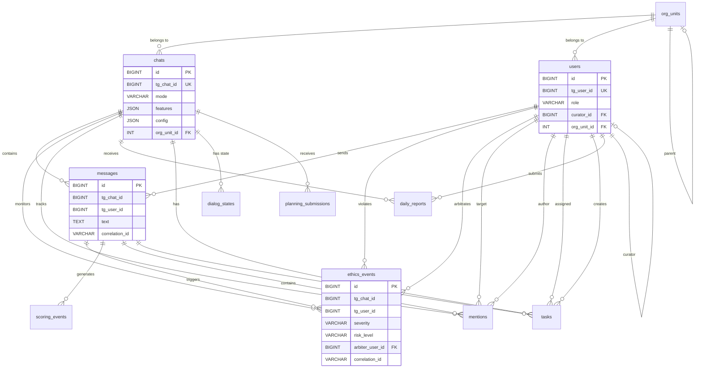
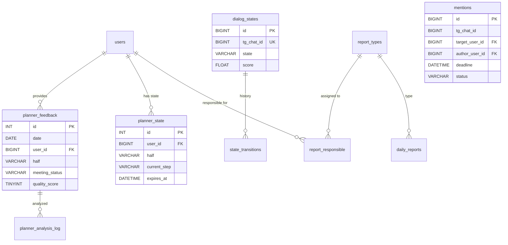
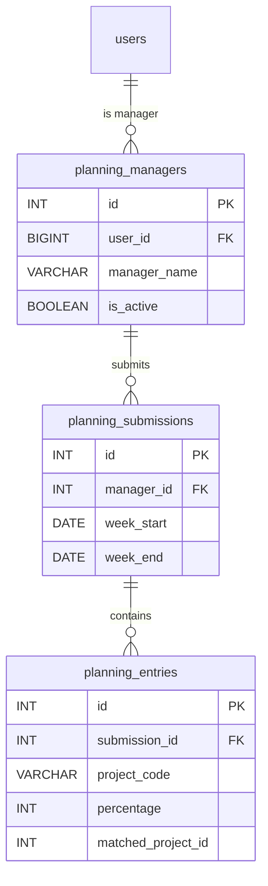

# Схема базы данных Corporate Ethics Bot

## Обзор

**База данных**: `2_kadry_4_ethics_bot`

**СУБД**: MariaDB 10.x

**Драйвер**: aiomysql (async)

**ORM**: SQLAlchemy 2.0

**Всего таблиц**: 21

---

## 1. Список таблиц

| № | Таблица | Назначение | Записей* |
|---|---------|-----------|---------|
| 1 | `chats` | Регистрация чатов с mode + features + config | 3 |
| 2 | `users` | Пользователи с ролями | 7 |
| 3 | `messages` | История сообщений | 382 |
| 4 | `ethics_events` | Обнаруженные нарушения этики | 357 |
| 5 | `planner_feedback` | CEO feedback (v1.3: UNIQUE date+user_id+half) | 0 |
| 6 | `planner_state` | FSM состояние planner (v1.3: UNIQUE user_id+half) | 2 |
| 7 | `planner_analysis_log` | Логи AI анализа planner feedback | 0 |
| 8 | `mentions` | @mention tracking с deadline | 81 |
| 9 | `notifications` | Логи отправленных уведомлений | 0 |
| 10 | `daily_reports` | Ежедневные отчёты | 40 |
| 11 | `tasks` | Задачи с дедлайнами | 0 |
| 12 | `scoring_events` | Индивидуальные сигналы для скоринга | 46 |
| 13 | `dialog_states` | FSM состояния диалога | 1 |
| 14 | `state_transitions` | История переходов состояний FSM | 16 |
| 15 | `planning_managers` | Менеджеры для недельного планирования | 1 |
| 16 | `planning_submissions` | Недельные планы | 2 |
| 17 | `planning_entries` | Строки планов (проект + процент) | 10 |
| 18 | `report_types` | Типы отчётов (РОП, ПЛК) | 2 |
| 19 | `report_responsible` | Ответственные за отчёты | 4 |
| 20 | `org_units` | Организационные единицы | 3 |
| 21 | `audit_log` | Аудит событий | 382 |

*Примерное количество на момент анализа (11.02.2026)

---

## 2. Структура таблиц

### 2.1 chats — Регистрация чатов

**Назначение**: Multi-chat configuration система. Хранит mode, feature flags и per-chat параметры в JSON.

```sql
CREATE TABLE chats (
    id BIGINT PRIMARY KEY AUTO_INCREMENT,
    tg_chat_id BIGINT NOT NULL UNIQUE,
    chat_title VARCHAR(255),
    mode VARCHAR(20) DEFAULT 'viewer',
    features JSON,
    config JSON,
    org_unit_id INT,
    is_active BOOLEAN DEFAULT TRUE,
    created_at DATETIME DEFAULT CURRENT_TIMESTAMP,
    updated_at DATETIME DEFAULT CURRENT_TIMESTAMP ON UPDATE CURRENT_TIMESTAMP,

    FOREIGN KEY (org_unit_id) REFERENCES org_units(id)
);
```

**Поля**:
- `id` — PK, auto increment
- `tg_chat_id` — Telegram chat ID (UNIQUE, используется для lookup)
- `chat_title` — Название чата
- `mode` — Режим работы: `viewer` | `compliance` | `operator` | `evaluation` | `planning` | `assist`
- `features` — JSON с feature flags: `{"ethics_analysis": true, "planner": true}`
- `config` — JSON с параметрами: `{"planner_ceo_user_id": 123, "mention_deadline_minutes": 15}`
- `org_unit_id` — FK на организационную единицу
- `is_active` — Флаг активности чата

**Индексы**:
- PRIMARY KEY (`id`)
- UNIQUE KEY (`tg_chat_id`)
- KEY (`org_unit_id`)

**Пример данных**:
```json
{
  "tg_chat_id": -1001234567890,
  "mode": "compliance",
  "features": {"ethics_analysis": true, "mention_tracking": true},
  "config": {"mention_deadline_minutes": 15}
}
```

---

### 2.2 users — Пользователи

**Назначение**: Пользователи Telegram с ролями и кураторами.

```sql
CREATE TABLE users (
    id BIGINT PRIMARY KEY AUTO_INCREMENT,
    tg_user_id BIGINT NOT NULL UNIQUE,
    username VARCHAR(255),
    first_name VARCHAR(255),
    last_name VARCHAR(255),
    role VARCHAR(50),
    curator_id BIGINT,
    org_unit_id INT,
    is_active BOOLEAN DEFAULT TRUE,
    created_at DATETIME DEFAULT CURRENT_TIMESTAMP,
    updated_at DATETIME DEFAULT CURRENT_TIMESTAMP ON UPDATE CURRENT_TIMESTAMP,

    FOREIGN KEY (curator_id) REFERENCES users(id),
    FOREIGN KEY (org_unit_id) REFERENCES org_units(id)
);
```

**Роли** (role):
- `MANAGER` — Менеджер
- `DEPUTY_DIRECTOR` — Заместитель директора
- `DIRECTOR` — Директор
- `HR_COMPLIANCE` — HR Compliance специалист

**Связи**:
- `curator_id` → self-reference (куратор — тоже user)
- `org_unit_id` → org_units

---

### 2.3 messages — История сообщений

**Назначение**: Полная история сообщений из Telegram для аудита и анализа.

```sql
CREATE TABLE messages (
    id BIGINT PRIMARY KEY AUTO_INCREMENT,
    tg_message_id BIGINT NOT NULL,
    tg_chat_id BIGINT NOT NULL,
    tg_user_id BIGINT NOT NULL,
    text TEXT,
    sent_at DATETIME NOT NULL,
    correlation_id VARCHAR(36),
    created_at DATETIME DEFAULT CURRENT_TIMESTAMP,

    INDEX idx_tg_chat_id (tg_chat_id),
    INDEX idx_tg_user_id (tg_user_id),
    INDEX idx_sent_at (sent_at),
    INDEX idx_correlation_id (correlation_id)
);
```

**Индексы**:
- `idx_tg_chat_id` — быстрый поиск по чату
- `idx_tg_user_id` — поиск по пользователю
- `idx_sent_at` — временной поиск
- `idx_correlation_id` — трекинг запросов

---

### 2.4 ethics_events — Нарушения этики

**Назначение**: Обнаруженные нарушения корпоративной этики с результатами анализа Claude AI.

```sql
CREATE TABLE ethics_events (
    id BIGINT PRIMARY KEY AUTO_INCREMENT,
    tg_chat_id BIGINT NOT NULL,
    tg_user_id BIGINT NOT NULL,
    tg_message_id BIGINT NOT NULL,
    rule_category VARCHAR(100),
    violation_type VARCHAR(100),
    severity VARCHAR(20),
    risk_level VARCHAR(20),
    ai_analysis TEXT,
    arbiter_user_id BIGINT,
    notification_type VARCHAR(50),
    correlation_id VARCHAR(36),
    created_at DATETIME DEFAULT CURRENT_TIMESTAMP,

    INDEX idx_tg_chat_id (tg_chat_id),
    INDEX idx_tg_user_id (tg_user_id),
    INDEX idx_risk_level (risk_level),
    INDEX idx_created_at (created_at),
    FOREIGN KEY (arbiter_user_id) REFERENCES users(id)
);
```

**Severity** (серьёзность):
- `LOW` — Низкая (0.0–0.3)
- `MEDIUM` — Средняя (0.3–0.7)
- `HIGH` — Высокая (0.7–1.0)

**Risk Level** (уровень риска):
- `LOW` — Низкий
- `MEDIUM` — Средний
- `HIGH` — Высокий

**Notification Type**:
- `SELF_FEEDBACK` — Обратная связь нарушителю
- `ARBITER_ALERT` — Уведомление арбитру
- `BLOCK_WARNING` — Предупреждение о блокировке

---

### 2.5 planner_feedback — CEO Planner Feedback (v1.3)

**Назначение**: Завершённые feedback записи CEO по результатам планёрок.

```sql
CREATE TABLE planner_feedback (
    id INT PRIMARY KEY AUTO_INCREMENT,
    date DATE NOT NULL,
    user_id BIGINT NOT NULL,
    half VARCHAR(10) NOT NULL,
    meeting_status VARCHAR(20),
    quality_score TINYINT,
    what_worked TEXT,
    what_to_add TEXT,
    main_problem TEXT,
    decision_taken TEXT,
    created_at DATETIME DEFAULT CURRENT_TIMESTAMP,

    UNIQUE KEY uk_pf_date_user_half (date, user_id, half),
    INDEX idx_user_id (user_id),
    INDEX idx_date (date),
    FOREIGN KEY (user_id) REFERENCES users(id)
);
```

**Ключевые поля**:
- `half` — `'morning'` | `'afternoon'` (v1.3: два цикла в день)
- `meeting_status` — `'held'` | `'postponed'` | `'not_held'` | `'no_response'`
- `quality_score` — Оценка качества 1–10 (только для `'held'`)

**UNIQUE constraint**: `(date, user_id, half)` — один feedback на полудень

---

### 2.6 planner_state — Planner FSM State (v1.3)

**Назначение**: Текущее состояние FSM для активных planner диалогов.

```sql
CREATE TABLE planner_state (
    id INT PRIMARY KEY AUTO_INCREMENT,
    user_id BIGINT NOT NULL,
    half VARCHAR(10) NOT NULL,
    current_step VARCHAR(50) NOT NULL,
    date DATE NOT NULL,
    meeting_status VARCHAR(20),
    quality_score TINYINT,
    what_worked TEXT,
    what_to_add TEXT,
    main_problem TEXT,
    decision_taken TEXT,
    expires_at DATETIME,
    created_at DATETIME DEFAULT CURRENT_TIMESTAMP,
    updated_at DATETIME DEFAULT CURRENT_TIMESTAMP ON UPDATE CURRENT_TIMESTAMP,

    UNIQUE KEY uk_ps_user_half (user_id, half),
    INDEX idx_expires_at (expires_at),
    FOREIGN KEY (user_id) REFERENCES users(id)
);
```

**FSM Steps** (current_step):
1. `awaiting_status` — Ожидание нажатия кнопки (✅/⏳/❌)
2. `awaiting_quality` — Ожидание оценки качества (1-10)
3. `awaiting_worked` — Ожидание "что сработало"
4. `awaiting_to_add` — Ожидание "что добавить"
5. `awaiting_problem` — Ожидание "главная проблема" (optional)
6. `awaiting_decision` — Ожидание "решение" (optional)

**UNIQUE constraint**: `(user_id, half)` — два параллельных FSM (morning + afternoon)

**TTL**: `expires_at` используется для cleanup просроченных состояний

---

### 2.7 planner_analysis_log — AI Analysis Log

**Назначение**: Логи анализа feedback через Claude API.

```sql
CREATE TABLE planner_analysis_log (
    id INT PRIMARY KEY AUTO_INCREMENT,
    feedback_id INT NOT NULL,
    prompt_used TEXT,
    ai_response TEXT,
    model_name VARCHAR(100),
    tokens_used INT,
    created_at DATETIME DEFAULT CURRENT_TIMESTAMP,

    FOREIGN KEY (feedback_id) REFERENCES planner_feedback(id)
);
```

---

### 2.8 mentions — @Mention Tracking

**Назначение**: Отслеживание @упоминаний пользователей с дедлайнами ответа.

```sql
CREATE TABLE mentions (
    id BIGINT PRIMARY KEY AUTO_INCREMENT,
    tg_chat_id BIGINT NOT NULL,
    target_user_id BIGINT NOT NULL,
    author_user_id BIGINT NOT NULL,
    tg_message_id BIGINT NOT NULL,
    text TEXT,
    deadline DATETIME NOT NULL,
    status VARCHAR(20) DEFAULT 'waiting',
    answered_at DATETIME,
    correlation_id VARCHAR(36),
    created_at DATETIME DEFAULT CURRENT_TIMESTAMP,

    INDEX idx_tg_chat_id (tg_chat_id),
    INDEX idx_target_user_id (target_user_id),
    INDEX idx_status (status),
    INDEX idx_deadline (deadline)
);
```

**Status**:
- `waiting` — Ожидание ответа
- `answered` — Ответ получен
- `overdue` — Просрочено

**Deadline** = время упоминания + `mention_deadline_minutes` (из config)

---

### 2.9 notifications — Логи уведомлений

**Назначение**: Логирование всех отправленных Telegram уведомлений.

```sql
CREATE TABLE notifications (
    id BIGINT PRIMARY KEY AUTO_INCREMENT,
    tg_chat_id BIGINT NOT NULL,
    tg_user_id BIGINT,
    notification_type VARCHAR(50) NOT NULL,
    message_text TEXT,
    sent_at DATETIME DEFAULT CURRENT_TIMESTAMP,
    correlation_id VARCHAR(36),
    success BOOLEAN DEFAULT TRUE,
    error_message TEXT,

    INDEX idx_tg_chat_id (tg_chat_id),
    INDEX idx_notification_type (notification_type),
    INDEX idx_sent_at (sent_at)
);
```

**Notification Types**:
- `ETHICS_SELF_FEEDBACK`
- `ETHICS_ARBITER_ALERT`
- `MENTION_REMINDER`
- `REPORT_REMINDER`
- `PLANNER_MORNING_INFO`
- `PLANNER_FEEDBACK_REQUEST`
- `PLANNER_ANALYSIS_REPORT`

---

### 2.10 daily_reports — Ежедневные отчёты

**Назначение**: Регистрация ежедневных отчётов (РОП, ПЛК).

```sql
CREATE TABLE daily_reports (
    id BIGINT PRIMARY KEY AUTO_INCREMENT,
    tg_chat_id BIGINT NOT NULL,
    tg_user_id BIGINT NOT NULL,
    report_type_id INT NOT NULL,
    report_date DATE NOT NULL,
    tg_message_id BIGINT,
    submitted_at DATETIME DEFAULT CURRENT_TIMESTAMP,

    INDEX idx_tg_chat_id (tg_chat_id),
    INDEX idx_report_date (report_date),
    FOREIGN KEY (report_type_id) REFERENCES report_types(id),
    FOREIGN KEY (tg_user_id) REFERENCES users(id)
);
```

---

### 2.11 tasks — Задачи с дедлайнами

**Назначение**: Трекинг задач, упомянутых в сообщениях.

```sql
CREATE TABLE tasks (
    id BIGINT PRIMARY KEY AUTO_INCREMENT,
    tg_chat_id BIGINT NOT NULL,
    assigned_user_id BIGINT NOT NULL,
    author_user_id BIGINT NOT NULL,
    description TEXT NOT NULL,
    deadline DATETIME,
    status VARCHAR(20) DEFAULT 'pending',
    source_message_id BIGINT,
    created_at DATETIME DEFAULT CURRENT_TIMESTAMP,
    completed_at DATETIME,

    INDEX idx_tg_chat_id (tg_chat_id),
    INDEX idx_assigned_user_id (assigned_user_id),
    INDEX idx_status (status),
    INDEX idx_deadline (deadline)
);
```

**Status**:
- `pending` — В работе
- `completed` — Выполнено
- `overdue` — Просрочено

**Примечание**: Частично реализовано, упоминается в timer_worker.

---

### 2.12 scoring_events — Scoring Signals

**Назначение**: Индивидуальные сигналы для scoring engine (FSM NORMAL→TENSION→CONFLICT→ESCALATION).

```sql
CREATE TABLE scoring_events (
    id BIGINT PRIMARY KEY AUTO_INCREMENT,
    tg_chat_id BIGINT NOT NULL,
    tg_user_id BIGINT NOT NULL,
    tg_message_id BIGINT NOT NULL,
    signal_type VARCHAR(50) NOT NULL,
    weight FLOAT NOT NULL,
    context TEXT,
    correlation_id VARCHAR(36),
    created_at DATETIME DEFAULT CURRENT_TIMESTAMP,

    INDEX idx_tg_chat_id (tg_chat_id),
    INDEX idx_signal_type (signal_type),
    INDEX idx_created_at (created_at)
);
```

**Signal Types**:
- `ETHICAL_VIOLATION`
- `REPEATED_VIOLATION`
- `HIGH_SEVERITY`
- `MENTION_OVERDUE`
- `REPORT_MISSED`
- `POSITIVE_FEEDBACK` (снижает score)

---

### 2.13 dialog_states — FSM Dialog States

**Назначение**: Текущее состояние диалога в чате (для scoring engine).

```sql
CREATE TABLE dialog_states (
    id BIGINT PRIMARY KEY AUTO_INCREMENT,
    tg_chat_id BIGINT NOT NULL UNIQUE,
    state VARCHAR(20) DEFAULT 'NORMAL',
    score FLOAT DEFAULT 0.0,
    last_transition_at DATETIME,
    created_at DATETIME DEFAULT CURRENT_TIMESTAMP,
    updated_at DATETIME DEFAULT CURRENT_TIMESTAMP ON UPDATE CURRENT_TIMESTAMP,

    INDEX idx_state (state)
);
```

**States**:
- `NORMAL` — Нормальное общение (score < 30)
- `TENSION` — Напряжение (score 30–60)
- `CONFLICT` — Конфликт (score 60–80)
- `ESCALATION` — Эскалация (score > 80)

---

### 2.14 state_transitions — История переходов FSM

**Назначение**: История переходов состояний dialog_states.

```sql
CREATE TABLE state_transitions (
    id BIGINT PRIMARY KEY AUTO_INCREMENT,
    tg_chat_id BIGINT NOT NULL,
    from_state VARCHAR(20),
    to_state VARCHAR(20) NOT NULL,
    reason TEXT,
    score_before FLOAT,
    score_after FLOAT,
    created_at DATETIME DEFAULT CURRENT_TIMESTAMP,

    INDEX idx_tg_chat_id (tg_chat_id),
    INDEX idx_created_at (created_at)
);
```

---

### 2.15 planning_managers — Менеджеры для планирования

**Назначение**: Регистрация менеджеров, участвующих в недельном планировании.

```sql
CREATE TABLE planning_managers (
    id INT PRIMARY KEY AUTO_INCREMENT,
    user_id BIGINT NOT NULL UNIQUE,
    manager_name VARCHAR(255) NOT NULL,
    is_active BOOLEAN DEFAULT TRUE,
    created_at DATETIME DEFAULT CURRENT_TIMESTAMP,

    FOREIGN KEY (user_id) REFERENCES users(id)
);
```

---

### 2.16 planning_submissions — Недельные планы

**Назначение**: Недельные планы менеджеров (header).

```sql
CREATE TABLE planning_submissions (
    id INT PRIMARY KEY AUTO_INCREMENT,
    manager_id INT NOT NULL,
    tg_chat_id BIGINT NOT NULL,
    week_start DATE NOT NULL,
    week_end DATE NOT NULL,
    submitted_at DATETIME DEFAULT CURRENT_TIMESTAMP,

    INDEX idx_manager_id (manager_id),
    INDEX idx_week_start (week_start),
    FOREIGN KEY (manager_id) REFERENCES planning_managers(id)
);
```

---

### 2.17 planning_entries — Строки планов

**Назначение**: Строки недельных планов (проект + процент).

```sql
CREATE TABLE planning_entries (
    id INT PRIMARY KEY AUTO_INCREMENT,
    submission_id INT NOT NULL,
    project_code VARCHAR(50),
    project_name VARCHAR(255),
    percentage INT NOT NULL,
    matched_project_id INT,

    INDEX idx_submission_id (submission_id),
    FOREIGN KEY (submission_id) REFERENCES planning_submissions(id)
);
```

**Связь с внешней БД**:
- `matched_project_id` → `2_kadry_4.ref_projects_wa.id` (через AI matching)

---

### 2.18 report_types — Типы отчётов

**Назначение**: Справочник типов отчётов.

```sql
CREATE TABLE report_types (
    id INT PRIMARY KEY AUTO_INCREMENT,
    name VARCHAR(50) NOT NULL UNIQUE,
    description TEXT,
    keywords JSON,
    is_active BOOLEAN DEFAULT TRUE
);
```

**Примеры**:
```json
[
  {"name": "РОП", "keywords": ["РОП", "рапорт о проделанной"]},
  {"name": "ПЛК", "keywords": ["ПЛК", "план контактов"]}
]
```

---

### 2.19 report_responsible — Ответственные за отчёты

**Назначение**: Mapping пользователей на типы отчётов.

```sql
CREATE TABLE report_responsible (
    id INT PRIMARY KEY AUTO_INCREMENT,
    user_id BIGINT NOT NULL,
    report_type_id INT NOT NULL,
    is_active BOOLEAN DEFAULT TRUE,

    UNIQUE KEY uk_user_report (user_id, report_type_id),
    FOREIGN KEY (user_id) REFERENCES users(id),
    FOREIGN KEY (report_type_id) REFERENCES report_types(id)
);
```

---

### 2.20 org_units — Организационные единицы

**Назначение**: Справочник оргединиц.

```sql
CREATE TABLE org_units (
    id INT PRIMARY KEY AUTO_INCREMENT,
    name VARCHAR(255) NOT NULL,
    code VARCHAR(50) UNIQUE,
    parent_id INT,
    is_active BOOLEAN DEFAULT TRUE,

    FOREIGN KEY (parent_id) REFERENCES org_units(id)
);
```

**Примеры**:
- Отдел продаж
- Отдел разработки
- HR

---

### 2.21 audit_log — Аудит событий

**Назначение**: Полный аудит всех событий системы.

```sql
CREATE TABLE audit_log (
    id BIGINT PRIMARY KEY AUTO_INCREMENT,
    tg_chat_id BIGINT,
    tg_user_id BIGINT,
    event_type VARCHAR(50) NOT NULL,
    event_data JSON,
    correlation_id VARCHAR(36),
    created_at DATETIME DEFAULT CURRENT_TIMESTAMP,

    INDEX idx_event_type (event_type),
    INDEX idx_created_at (created_at),
    INDEX idx_correlation_id (correlation_id)
);
```

**Event Types**:
- `MESSAGE_RECEIVED`
- `ETHICS_VIOLATION_DETECTED`
- `MENTION_CREATED`
- `REPORT_SUBMITTED`
- `PLANNER_FEEDBACK_COMPLETED`
- `STATE_TRANSITION`

---

## 3. ER-диаграмма

**Часть 1: Основные связи (chats, users, messages)**



**Часть 2: Planner и Tracking модули**



**Часть 3: Planning модуль**



---

## 4. Ключевые связи

### 4.1 Multi-Chat Configuration

```
chats (mode + features + config)
  ↓
Определяет поведение бота в каждом чате:
  - viewer: только логирование
  - compliance: ethics + mention + report
  - assist: CEO planner
  - planning: weekly plans
```

### 4.2 Planner Two-Cycle (v1.3)

```
planner_state
  UNIQUE(user_id, half)
  ↓
  Два параллельных FSM:
    - half='morning'  → 14:00 feedback
    - half='afternoon' → 20:30 feedback
  ↓
planner_feedback
  UNIQUE(date, user_id, half)
  ↓
  Два feedback в день
```

### 4.3 Ethics Pipeline

```
messages
  ↓
ethics_events (Claude analysis)
  ↓
scoring_events (signals)
  ↓
dialog_states (FSM: NORMAL→TENSION→CONFLICT→ESCALATION)
  ↓
state_transitions (history)
```

### 4.4 Mention Tracking

```
messages (contains @username)
  ↓
mentions (deadline = now + 15min)
  ↓
TimerWorker checks every 60 sec
  ↓
notifications (reminder)
```

---

## 5. Индексы и производительность

### 5.1 Ключевые индексы

**Часто используемые поиски**:

```sql
-- Lookup по tg_chat_id (в каждом запросе)
INDEX idx_tg_chat_id ON messages(tg_chat_id);
INDEX idx_tg_chat_id ON ethics_events(tg_chat_id);
INDEX idx_tg_chat_id ON mentions(tg_chat_id);

-- Correlation ID tracking
INDEX idx_correlation_id ON messages(correlation_id);
INDEX idx_correlation_id ON ethics_events(correlation_id);
INDEX idx_correlation_id ON audit_log(correlation_id);

-- Временные поиски (для Timer Worker)
INDEX idx_deadline ON mentions(deadline);
INDEX idx_expires_at ON planner_state(expires_at);
INDEX idx_created_at ON ethics_events(created_at);

-- User lookup
INDEX idx_tg_user_id ON messages(tg_user_id);
INDEX idx_target_user_id ON mentions(target_user_id);
```

### 5.2 UNIQUE constraints

**Критичные для бизнес-логики**:

```sql
-- Один чат = одна конфигурация
UNIQUE KEY (tg_chat_id) ON chats;

-- Один user = одна запись
UNIQUE KEY (tg_user_id) ON users;

-- Два planner FSM в день (v1.3)
UNIQUE KEY (user_id, half) ON planner_state;

-- Два feedback в день (v1.3)
UNIQUE KEY (date, user_id, half) ON planner_feedback;

-- Dialog state per chat
UNIQUE KEY (tg_chat_id) ON dialog_states;
```

---

## 6. JSON поля

### 6.1 chats.features

**Тип**: JSON object

**Структура**:
```json
{
  "ethics_analysis": true,      // Анализ этики
  "mention_tracking": true,      // Отслеживание @mentions
  "report_reminders": true,      // Напоминания об отчётах
  "planner": false,              // CEO planner
  "planning": false              // Недельное планирование
}
```

**Использование**:
```python
ctx.has_feature('planner')  # bool
```

### 6.2 chats.config

**Тип**: JSON object

**Структура**:
```json
{
  "mention_deadline_minutes": 15,
  "report_check_times": [
    {"hour": 10, "minute": 45},
    {"hour": 14, "minute": 15},
    {"hour": 19, "minute": 15}
  ],
  "planner_ceo_user_id": 987654321,
  "planner_timezone": "Europe/Moscow",
  "planner_eod_hour": 21,
  "planner_eod_minute": 30,
  "ethics_threshold": 0.7
}
```

**Использование**:
```python
deadline = ctx.get_config('mention_deadline_minutes', 15)
ceo_id = ctx.get_config('planner_ceo_user_id')
```

### 6.3 report_types.keywords

**Тип**: JSON array

**Структура**:
```json
["РОП", "рапорт о проделанной", "rapport"]
```

### 6.4 audit_log.event_data

**Тип**: JSON object (произвольная структура)

**Примеры**:
```json
{
  "event": "PLANNER_FEEDBACK_COMPLETED",
  "user_id": 123,
  "half": "morning",
  "quality_score": 8
}
```

---

## 7. Enum-подобные поля

### 7.1 chats.mode

**Значения**:
- `viewer` — Только логирование (no actions)
- `compliance` — Мониторинг этики + mention + report
- `operator` — Оператор (зарезервировано)
- `evaluation` — Оценка (зарезервировано)
- `planning` — Недельное планирование менеджеров
- `assist` — CEO assist (planner)

### 7.2 users.role

**Значения**:
- `MANAGER`
- `DEPUTY_DIRECTOR`
- `DIRECTOR`
- `HR_COMPLIANCE`

### 7.3 planner_state.current_step

**Значения** (FSM steps):
1. `awaiting_status`
2. `awaiting_quality`
3. `awaiting_worked`
4. `awaiting_to_add`
5. `awaiting_problem`
6. `awaiting_decision`

### 7.4 planner_feedback.meeting_status

**Значения**:
- `held` — Проведено (✅ Выполнено)
- `postponed` — Перенесено (⏳ Частично)
- `not_held` — Не проведено (❌ Не удалось)
- `no_response` — Нет ответа (auto-close в 21:30)

### 7.5 mentions.status

**Значения**:
- `waiting` — Ожидание ответа
- `answered` — Ответ получен
- `overdue` — Просрочено

### 7.6 tasks.status

**Значения**:
- `pending` — В работе
- `completed` — Выполнено
- `overdue` — Просрочено

### 7.7 dialog_states.state

**Значения** (FSM states):
- `NORMAL` — score < 30
- `TENSION` — score 30–60
- `CONFLICT` — score 60–80
- `ESCALATION` — score > 80

### 7.8 ethics_events.severity

**Значения**:
- `LOW` — 0.0–0.3
- `MEDIUM` — 0.3–0.7
- `HIGH` — 0.7–1.0

### 7.9 ethics_events.risk_level

**Значения**:
- `LOW`
- `MEDIUM`
- `HIGH`

---

## 8. Миграции

### 8.1 История миграций

| Файл | Описание | Дата |
|------|----------|------|
| `001_initial_schema.sql` | Начальная схема (chats, users, messages, ethics_events, etc.) | ~2025-10 |
| `002_add_planner.sql` | Добавление planner_feedback, planner_state (v1.0) | ~2025-11 |
| `003_planner_fixes.sql` | Фиксы planner | ~2025-12 |
| `004_planning_service.sql` | Недельное планирование (planning_*) | ~2026-01 |
| `005_planner_v1.3.sql` | Planner v1.3 (two-cycle: добавление `half` field) | 2026-02-11 |

### 8.2 Ключевые изменения в v1.3

**Migration `005_planner_v1.3.sql`**:

```sql
-- Добавить поле `half`
ALTER TABLE planner_state ADD COLUMN half VARCHAR(10) NOT NULL DEFAULT 'morning';
ALTER TABLE planner_feedback ADD COLUMN half VARCHAR(10) NOT NULL DEFAULT 'morning';

-- Изменить UNIQUE constraints
ALTER TABLE planner_state DROP INDEX user_id;
ALTER TABLE planner_state ADD UNIQUE KEY uk_ps_user_half (user_id, half);

ALTER TABLE planner_feedback DROP INDEX uk_pf_date_user;
ALTER TABLE planner_feedback ADD UNIQUE KEY uk_pf_date_user_half (date, user_id, half);

-- Индекс на half
ALTER TABLE planner_state ADD INDEX idx_half (half);
ALTER TABLE planner_feedback ADD INDEX idx_half (half);
```

**Impact**:
- Позволяет два параллельных FSM: `half='morning'` и `half='afternoon'`
- Два feedback в день: UNIQUE(date, user_id, half)

---

## 9. Связь с внешней БД

### 9.1 External Reference DB

**База**: `2_kadry_4`

**Таблицы**:
- `ref_projects_wa` — Справочник проектов
- `ref_project_groups` — Группы проектов

**Использование**:
```python
# В PlanningService
matched_project_id = await match_project_with_ai(
    project_name,
    external_db='2_kadry_4.ref_projects_wa'
)

planning_entry.matched_project_id = matched_project_id
```

**Связь**:
- `planning_entries.matched_project_id` → `2_kadry_4.ref_projects_wa.id`
- **НЕ через FOREIGN KEY** (разные базы)
- Matching через Claude AI

---

## 10. Резервное копирование и обслуживание

### 10.1 Backup Strategy

```bash
# Full dump
mysqldump -u root -p 2_kadry_4_ethics_bot > backup_$(date +%Y%m%d).sql

# Tables only (no data)
mysqldump -u root -p --no-data 2_kadry_4_ethics_bot > schema.sql

# Specific table
mysqldump -u root -p 2_kadry_4_ethics_bot planner_feedback > planner_backup.sql
```

### 10.2 Cleanup Jobs

**Автоматический cleanup** (в Timer Worker):

```python
# Удаление просроченных planner_state
DELETE FROM planner_state WHERE expires_at < NOW();

# Архивация старых messages (>90 дней)
# Архивация старых audit_log (>180 дней)
```

### 10.3 Проверка целостности

```sql
-- Проверка orphan records
SELECT COUNT(*) FROM ethics_events e
LEFT JOIN messages m ON e.tg_message_id = m.tg_message_id
WHERE m.id IS NULL;

-- Проверка консистентности planner
SELECT date, user_id, half, COUNT(*) AS cnt
FROM planner_feedback
GROUP BY date, user_id, half
HAVING cnt > 1;  -- Должно быть 0

-- Проверка FSM states
SELECT * FROM planner_state WHERE expires_at < NOW();  -- Должно быть пусто
```

---

## Заключение

База данных Corporate Ethics Bot спроектирована с учётом:

1. **Multi-tenancy** — chats с JSON config для гибкой настройки per-chat
2. **FSM в БД** — planner_state, dialog_states вместо Redis
3. **Two-Cycle Architecture** — UNIQUE(user_id, half) для параллельных FSM
4. **Аудит и трекинг** — correlation_id, audit_log, notifications
5. **Производительность** — индексы на tg_chat_id, deadline, correlation_id
6. **Расширяемость** — JSON поля для config и features

Всего 21 таблица покрывают все аспекты: конфигурацию, мониторинг этики, planner, mention/report tracking, планирование, аудит.
